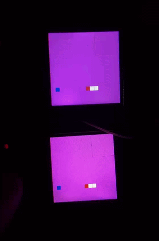

##### Main goal:
Try to implement reliable and fast communication on top of LORA modem. I have few boards known as GamePi-13 and i just soldered LORA to them and build whole firmware from scratch.

##### LORA settings:
- Frequency:        862 MHz
- BW:               250 KHz
- Spreading factor: 7
- Coding rate:      4/5
- Preamble length:  8
- Time on AIR: 20 ms

##### Implementation:
I get used to simple acknowledge system that works pretty good for simple communication. As soon as LORA is one duplex channel you can't really make transmitter works at the same time as receiver so it doesnt make much sense to send multiple messages with new sequence number without getting acknowledge for the oldest one. For demonstration i implement snake game when one player transmit everything to the other board.

##### How to run:  
```bash
git submodule update --init --recursive  
cmake -S . -B build -DPICO_BOARD=waveshare_rp2040_one   
cmake --build build --target tiny_psp &&  picotool load build/tiny_psp.uf2 -f --ser {SERIAL_NUMBER} && picotool reboot  
```

Board 1 serial number: E464C401431C5328  
Board 2 serial number: E464C40143501721 

